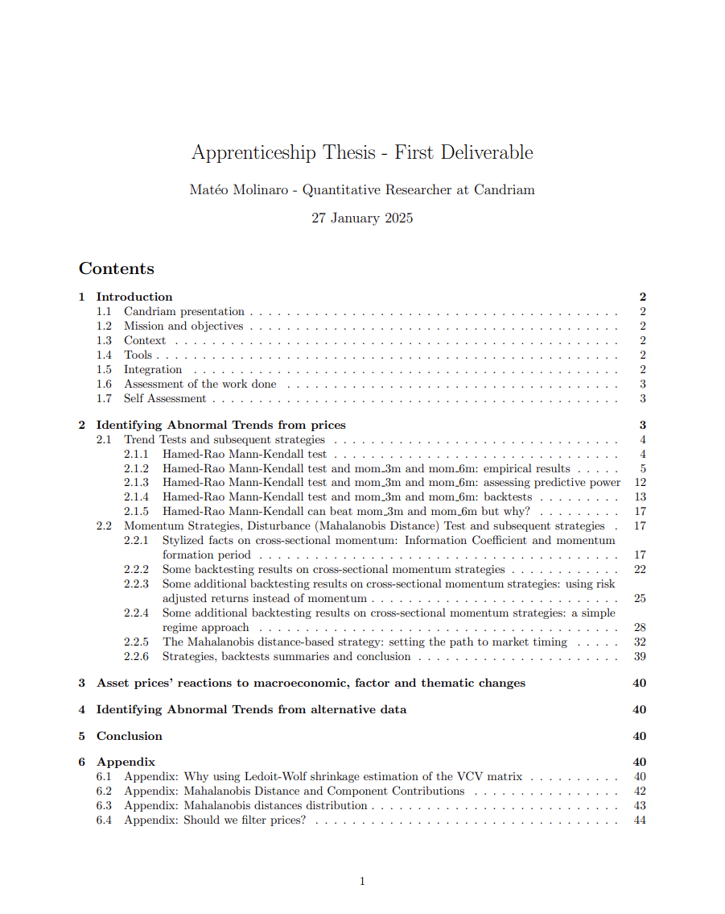
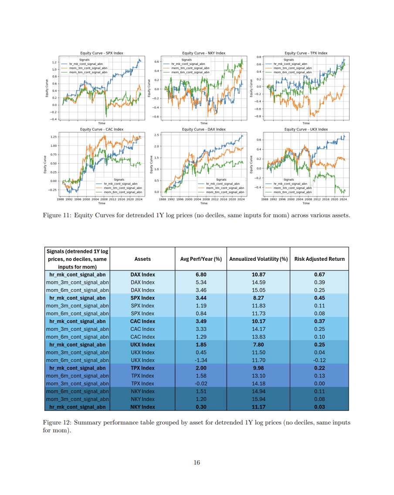
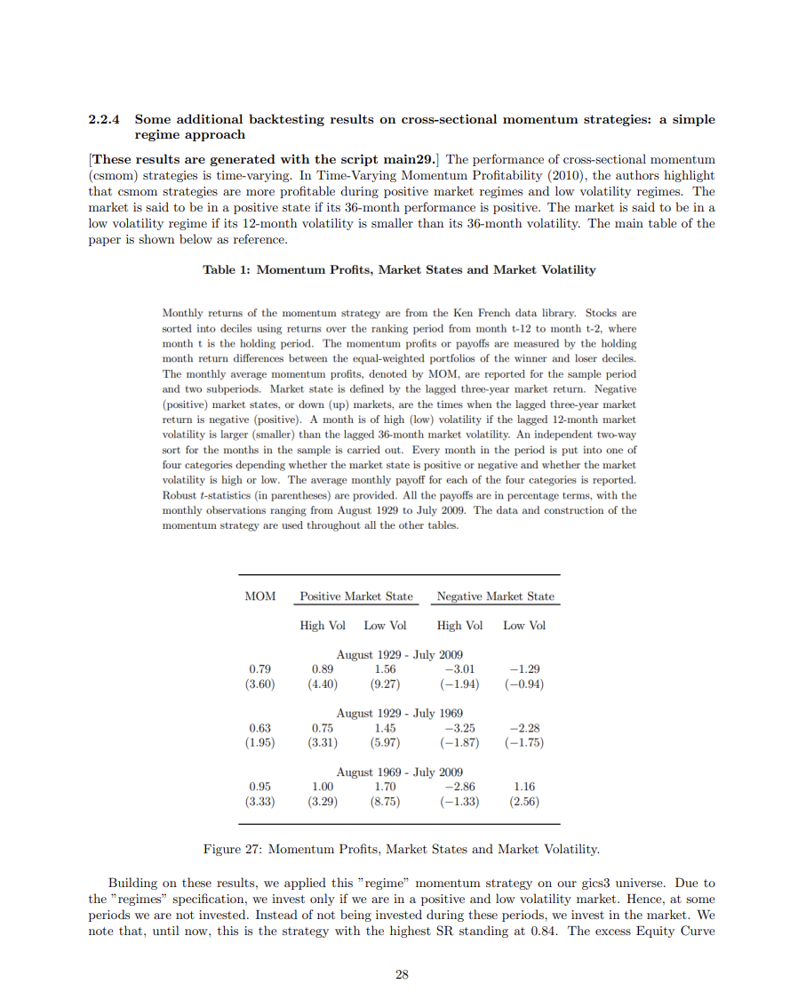
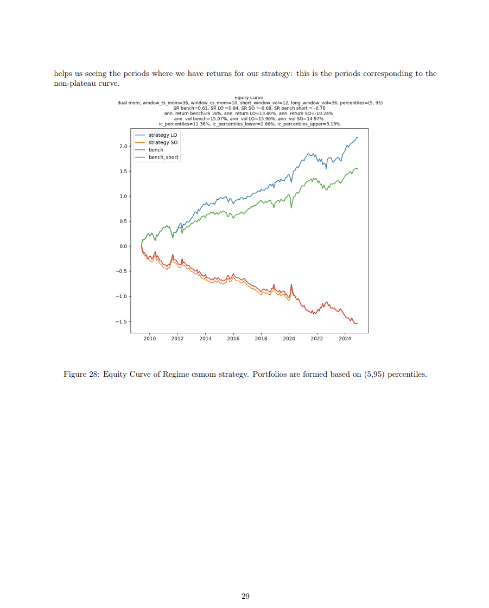

# Apprenticeship_Candriam
This repo contains a summary report (ongoing) of the work I've done at Candriam as an equity quantitative researcher. It also contains slides on cross-sectional strategies comparison between model-free approach (sorts) and linear (LASSO, ElasticNet) & non-linear (RF, NN) models.

